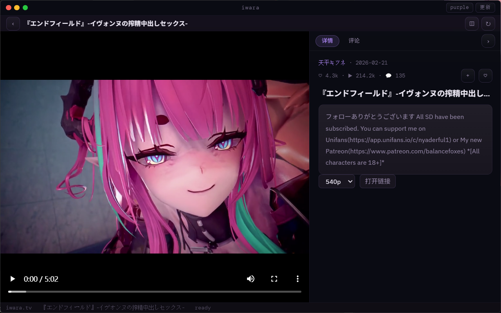
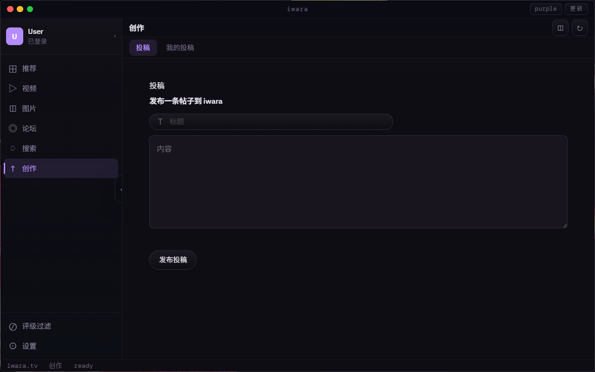
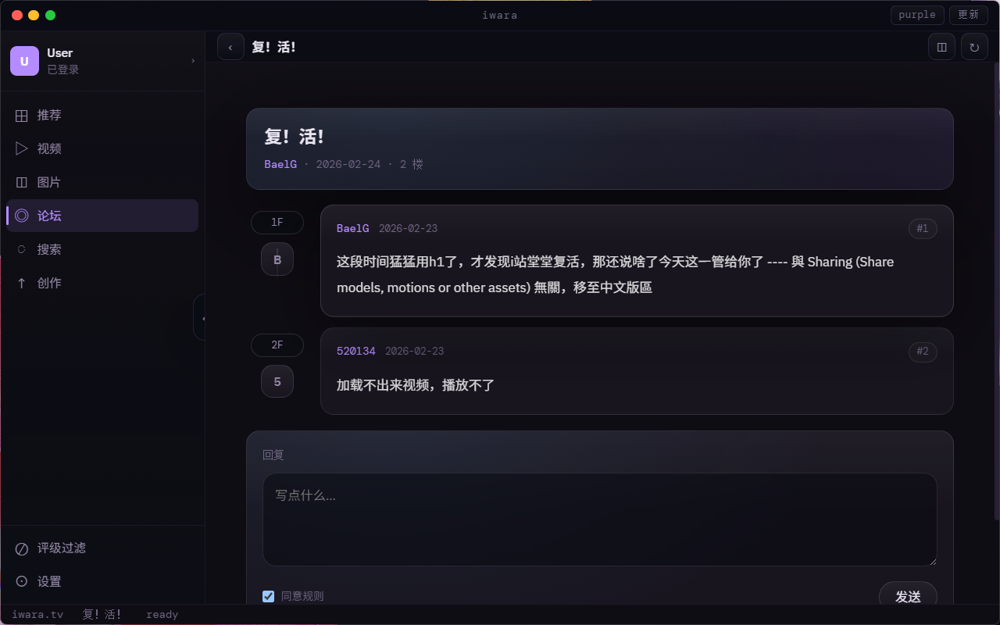
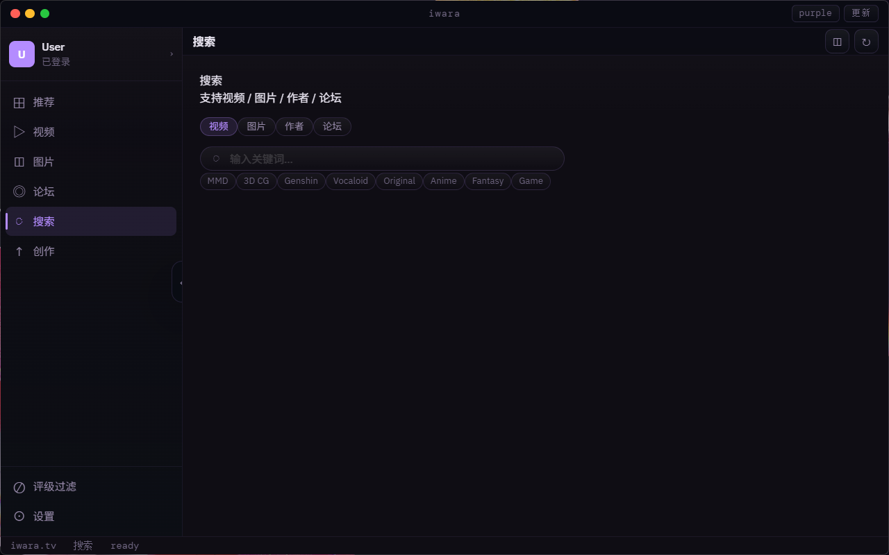
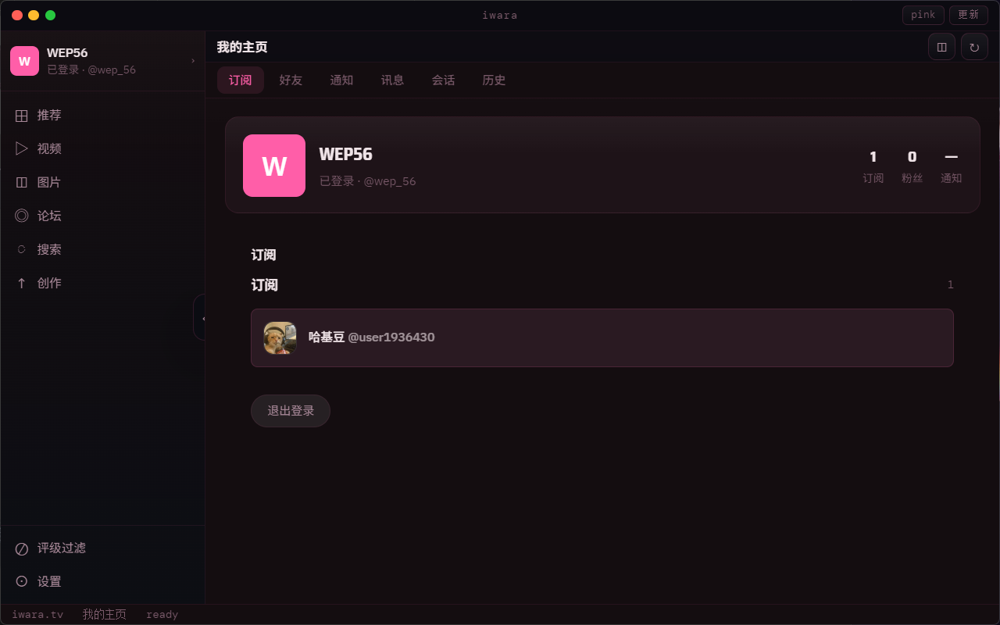
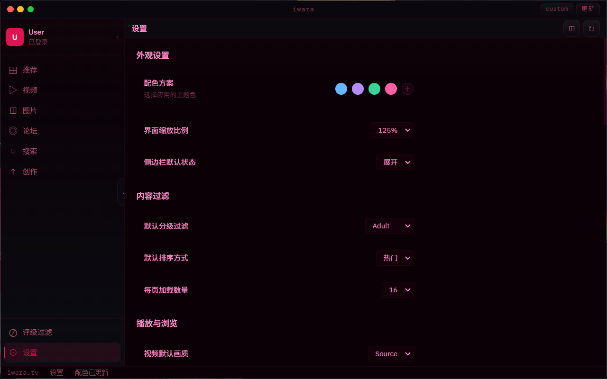

<div align="center">

# Iwara Electron Client

**Iwara 的非官方桌面客户端（Electron）**

以更清晰明了的方式展示 Iwara 平台的大部分内容

[](https://nodejs.org/)
[](https://www.electronjs.org/)
[](LICENSE)

</div>

---

## 📸 演示截图

### 内容浏览

<p align="center">
  
  <br />
  <em>内容浏览 - 视频/图片列表</em>
</p>

<p align="center">
  
  <br />
  <em>作品详情页面</em>
</p>

### 论坛与搜索

<p align="center">
  
  <br />
  <em>论坛浏览界面</em>
</p>

<p align="center">
  
  <br />
  <em>搜索功能</em>
</p>

### 用户与设置

<p align="center">
  
  <br />
  <em>用户主页界面</em>
</p>

<p align="center">
  
  <br />
  <em>设置页面</em>
</p>

---

## ✨ 核心功能

### 🎬 内容浏览
- **视频与图片浏览** - 流畅的媒体浏览体验
- **智能搜索** - 快速查找所需内容
- **论坛浏览** - 浏览帖子与参与讨论
- **帖子详情** - 深入阅读论坛内容

### 👤 用户功能
- **用户主页** - 查看用户资料与作品
- **评论系统** - 查看与发布评论
- **订阅与点赞** - 关注喜爱的创作者

### 🔐 账号管理
- **自动登录** - 保存账号密码，启动自动登录
- **登录状态持久化** - 重启应用保持登录状态
- **安全存储** - 使用加密存储敏感信息

### 🌐 网络支持
- **智能代理探测** - 自动检测并使用系统代理
- **多端口支持** - 支持常见代理端口（7890、10809 等）
- **环境变量** - 支持 `HTTPS_PROXY`/`HTTP_PROXY` 配置

---

## 🚀 快速开始

### 环境要求

- **Node.js** 18 或更高版本
- **Windows** 操作系统

### 安装依赖

```bash
npm install
```

### 启动应用

```bash
npm run start
```

---

## 📁 项目结构

```
Iwara/
├── main.js                 # Electron 主进程：窗口、网络、认证
├── preload.js              # 安全桥：window.electronAPI（ipcRenderer）
├── package.json            # 项目配置与依赖
├── img/                    # 演示图片目录
├── dist/                   # 构建输出目录
├── docs/                   # 项目文档
└── src/                    # 源代码目录
    └── renderer/           # 渲染进程：页面与 UI
        ├── index.html      # 主页面
        ├── renderer.js     # 入口与路由调度
        ├── api/            # API 端点与适配器
        ├── core/           # 公共模块
        │   ├── state/      # 状态管理
        │   ├── nav/        # 导航控制
        │   ├── renderers/  # 渲染器
        │   ├── bindings/   # 数据绑定
        │   └── comments/   # 评论系统
        ├── pages/          # 各页面模块
        │   ├── home.js     # 首页
        │   ├── video.js    # 视频相关
        │   ├── image.js    # 图片相关
        │   ├── forum.js    # 论坛相关
        │   ├── search.js   # 搜索页面
        │   ├── account.js  # 账户页面
        │   └── ...         # 其他页面
        └── utils/          # 通用工具
```

---

## 📄 页面概览

### 列表页面
- **Home** - 首页推荐内容
- **Video** - 视频列表
- **Image** - 图片列表
- **Forum** - 论坛帖子列表

### 功能页面
- **Search** - 搜索页面
- **Profile** - 个人资料
- **Settings** - 设置页面

### 详情页面
- **Video Detail** - 视频详情与播放
- **Image Detail** - 图片详情与浏览
- **Thread** - 论坛帖子详情
- **User** - 用户主页详情

---

## 🔧 技术栈

| 技术 | 用途 |
|------|------|
| [Electron](https://www.electronjs.org/) | 桌面应用框架 |
| [Node.js](https://nodejs.org/) | 运行时环境 |
| JavaScript | 主要编程语言 |
| IPC | 进程间通信 |

---

## 🔑 网络与登录

### 代理配置
- 自动读取系统环境变量 `HTTPS_PROXY` 和 `HTTP_PROXY`
- 自动探测本地常见代理端口（7890、10809 等）
- 智能选择可用的代理连接

### 登录管理
- Token 存储位置：Electron `userData` 目录下的 `tokens.json`
- 账号密码加密存储，支持自动登录
- 登录状态在应用重启后自动恢复

---

## 👨‍💻 开发说明

### 入口文件
- **主进程入口**：`main.js` - 负责窗口管理、网络请求、认证等
- **渲染进程入口**：`src/renderer/renderer.js` - 负责路由调度和页面加载

### 目录组织
- **页面模块**：放在 `src/renderer/pages/`，每个页面对应一个 JS 文件
- **公共能力**：放在 `src/renderer/core/`，包括状态管理、导航、渲染等

### 开发建议
- 遵循现有代码结构和命名规范
- 使用 IPC 进行主进程和渲染进程通信
- 公共功能提取到 `core` 目录复用

---

## 📝 版本历史

查看 [HISTORY.md](./history.md) 了解详细的版本更新记录。

---

## ⚠️ 免责声明

本项目为非官方客户端，仅用于学习与本地化体验。

- 请遵守目标站点的使用条款与服务协议
- 请遵守当地法律法规
- 本项目不对使用本软件造成的任何后果负责

---

## 🤝 贡献

欢迎提交 Issue 和 Pull Request！

---

## 📄 许可证

MIT License

---

<div align="center">

**如果觉得这个项目对你有帮助，请给个 ⭐️ Star 支持一下！**

</div>
